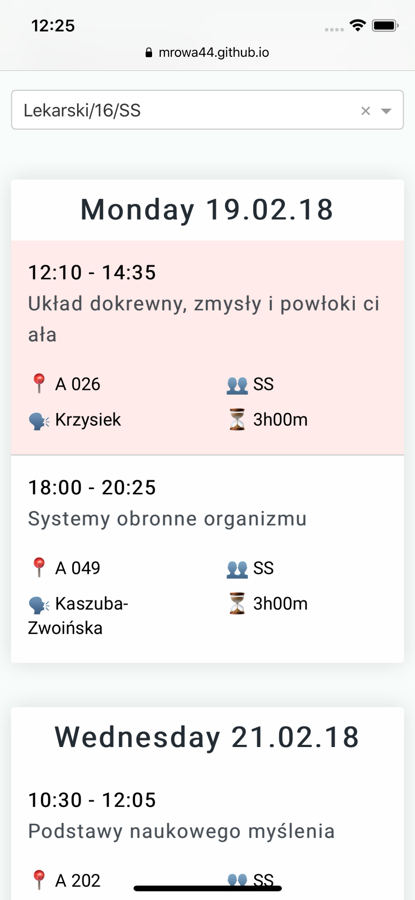

# School plan

> PWA app for displaying class plan of med students from "Krakowska Akademia im. Andrzeja Frycza Modrzewskiego"

Because the [original](https://dziekanat.ka.edu.pl/Plany/PlanyTokow/3264) one is unusable.

It may crash pretty easily as it's just fetching and parsing original html page ¯\\_(ツ)_/¯

In case it does, that's what it looked like [*]:

### Development

- `yarn` & `yarn start` to run locally
- `yarn fix` to automatically fix linter errors
- `yarn deploy` to deploy to gh pages

Eslint and stylelint are run as pre push hook.

Icon by [Tomas Knopp](https://thenounproject.com/tomas.knopp/) from the Noun Project
